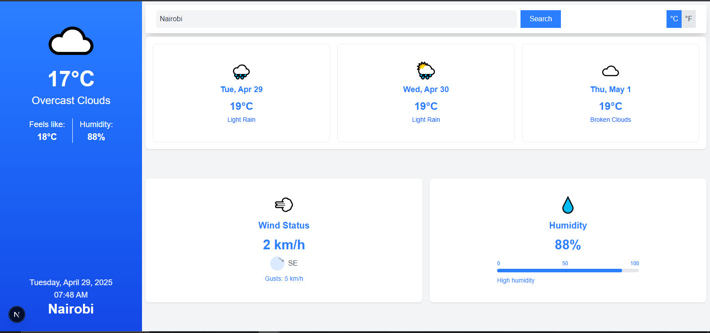

# Weather App Assessment

## Screenshot of the Weather App



## Overview

I have created a **Weather Application** using **Next.js** for the frontend and **Laravel** for the backend API. The application fetches weather data from the **OpenWeatherMap API** and displays the data on a user-friendly interface.

## Requirements

### Frontend

- **Framework**: Implemented with **Next.js** version **"15.3.1"** and **TypeScript**.
- **Design**: Used **RippleUI components** built on **Tailwind CSS** for the user interface.
- **AJAX Requests**: The application makes API calls to the **OpenWeatherMap API** using the **JS Fetch API**.
- **Features**:
  - **City name search box**: Users can search for cities. Nairobi City has been set as defualt City on App Load.
  - **Display current weather**: Shows real-time weather conditions.
  - **Display weather for the next 3 days**: Provides a 3-day weather forecast.
  - **Switch between Celsius and Fahrenheit**: Users can toggle between temperature units.
  - **Display current temperature, weather description, date, location, wind status, and humidity**: Comprehensive details about the weather are shown for the selected city.

### Backend

- **Framework**: Built with **Laravel** (latest version - "laravel/framework": "^9.19").
- **API**: The backend only implements the **API** for weather data. No blade views were needed.
- **HTTP Client**: Used **Laravel's HTTP Client** (built on Guzzle) to communicate with the **OpenWeatherMap API**.
- **API Security**: The API is open for access, as security was not required for this demo.

### API Key

- Signed up at [OpenWeatherMap](https://openweathermap.org/api) and obtained an API key to fetch weather data like current weather, 3-day forecast, wind status, and humidity.

### Bonus Features (Extra Points)

- **Type Safety**: Implemented type safety with **TypeScript**.
- **Commenting**: Proper code comments were added for clarity and maintainability.
- **GitHub Commits**: Followed proper GitHub commit practices to maintain clean and structured version control.
- **Code Elegance**: Focused on writing clean, reusable, and maintainable code.

### Required UI Elements

- **Search box** that accepts the city name.
- **Activate city search** using the **Geocoding API** to validate and fetch cities.
- **Switch between Degrees Celsius and Fahrenheit** with a toggle.
- **Icon showing the current day's weather icons** for better visualization.
- **Current temperature** and **current weather description** are displayed.
- **Date and Location** are shown to specify the forecasted region.
- **Weather for the next three days** is displayed in a clean, structured manner.
- **Wind status** and **Humidity information** are provided to give more comprehensive data about the weather conditions.

## Outcome

- The frontend is fully functional with a user-friendly UI that allows users to search for cities, view the weather for today, and check a 3-day forecast.
- The backend API serves weather data, which is consumed by the frontend application.
- The application supports toggling between Celsius and Fahrenheit, and shows wind status, humidity, and other weather details.

## How to Run the Application

1. **Frontend (Next.js)**:

   - Install dependencies:
     ```bash
     cd weather-api-ui
     npm install
     ```
   - Run the development server:
     ```bash
     npm run dev
     ```
   - Open the application in your browser: `http://localhost:3000`

2. **Backend (Laravel)**:
   - Install dependencies:
     ```bash
     cd weather-api
     composer install
     ```
   - Set up the environment variables in the `.env` file (make sure to include the OpenWeatherMap API key).
   - Run migrations if necessary:
     ```bash
     php artisan migrate
     ```
   - Start the backend server:
     ```bash
     php artisan serve
     ```
   - The backend will be available at `http://localhost:8000`.

## Functionalities The App Provides

- The app offers a user-friendly and visually appealing interface where users can search for a city and view detailed weather information.
- The application displays the current weather, a 3-day forecast, and key details like wind speed and humidity.
- Users have the option to switch between Celsius and Fahrenheit for temperature units.


---

**Hope This was Good Enough to be Invited to the Second Round Interview!!**
